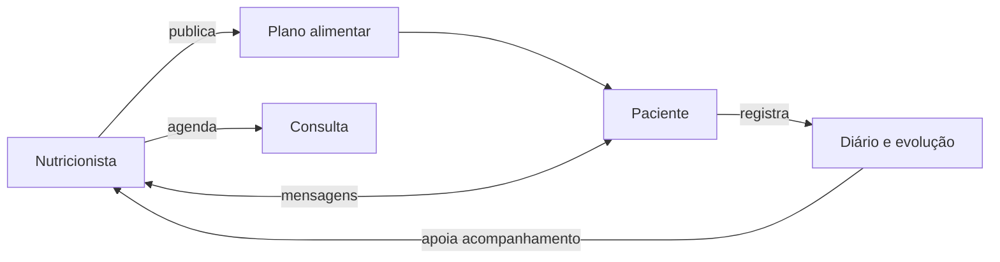

<p align="center">
  
</p>

<p align="center">
  <strong>Nutrição conectada, cuidado que evolui.</strong><br>
  Plataforma web para gestão nutricional e acompanhamento contínuo entre nutricionistas e pacientes.
</p>

<p align="center">
  
  
  
  
  
</p>

## Sobre o projeto

O **Nexus Nutra** é uma aplicação da linha Nexus criada para aproximar o atendimento profissional da rotina real do paciente. O nutricionista organiza pacientes, publica planos alimentares, acompanha registros e agenda consultas. O paciente acessa o plano, registra refeições e peso, consulta compromissos e conversa diretamente com o profissional.

Esta versão substitui o antigo protótipo LifeTrack e estabelece uma base segura, testável e responsiva para a evolução do produto.

> **Importante:** o sistema é uma ferramenta de apoio. Cálculos, planos e condutas devem ser revisados por nutricionista legalmente habilitado. A versão atual não substitui prontuário clínico certificado nem aconselhamento profissional.

## Novidades da v1.2.1 — Identidade Segura

- confirmação de e-mail obrigatória e reenvio controlado para novas contas;
- recuperação de senha com resposta que não revela se um endereço está cadastrado;
- tokens aleatórios de uso único, armazenados somente como hash;
- validade de 24 horas para confirmação e 30 minutos para recuperação;
- revogação de todas as sessões anteriores após alteração da senha;
- limitação de solicitações por conta e finalidade;
- adaptador SMTP com TLS/SSL, autenticação opcional e modo seguro para desenvolvimento;
- auditoria dos eventos de criação, verificação e recuperação da conta;
- autenticação separada em blueprint próprio;
- migration v3 compatível com contas e bancos das versões anteriores.

## Funcionalidades

### Para nutricionistas

- painel com pacientes, consultas, mensagens pendentes e planos ativos;
- cadastro e vínculo de pacientes ao consultório;
- prontuário resumido com objetivo, peso, planos e diário recente;
- criação rápida de planos por refeições;
- catálogo brasileiro pesquisável durante a prescrição;
- cálculo automático de calorias, proteínas, carboidratos, gorduras, fibras, cálcio e ferro;
- definição de metas e visualização de adequação nutricional;
- reutilização de planos como modelo e sugestões de alternativas;
- impressão profissional do plano em PDF pelo navegador;
- publicação do plano diretamente na conta do paciente;
- agenda para consultas presenciais e online, com disponibilidade, bloqueios e controle de conflitos;
- painel “Hoje”, estados da consulta, histórico, lembretes internos e exportação ICS;
- chat contextualizado com cada paciente.

### Para pacientes

- painel pessoal com plano atual e próximos compromissos;
- visualização clara do plano por refeições e alimentos;
- diário alimentar com adesão e nível de fome;
- histórico de peso com gráfico de evolução;
- agenda com confirmação, cancelamento, reagendamento e acesso seguro à consulta online;
- canal direto de mensagens com o nutricionista.

### Experiência e engenharia

- interface própria, responsiva e acessível em português do Brasil;
- senhas protegidas com o mecanismo seguro do Werkzeug;
- proteção CSRF em todas as operações de escrita;
- cookies de sessão `HttpOnly` e `SameSite=Lax`;
- expiração de sessão, revogação de outros dispositivos e bloqueio progressivo de login;
- trilha de auditoria para ações sensíveis da agenda;
- consentimento de privacidade versionado;
- confirmação de e-mail e recuperação de senha com tokens de uso único;
- entrega transacional configurável por SMTP com TLS ou SSL;
- cabeçalhos básicos de segurança;
- consultas parametrizadas e chaves estrangeiras ativas;
- testes automatizados e CI com GitHub Actions;
- banco SQLite inicializado automaticamente no primeiro uso.

## Tecnologias

| Camada | Tecnologia |
|---|---|
| Back-end | Python 3.10+ e Flask 3.1 |
| Interface | Jinja2, HTML5, CSS3 e JavaScript puro |
| Banco | SQLite 3 |
| Segurança | Werkzeug, sessão Flask, CSRF e tokens de identidade com SHA-256 |
| Comunicação | SMTP transacional com TLS/SSL |
| Qualidade | Pytest, Ruff e GitHub Actions |

## Como executar localmente

### 1. Preparar o ambiente

```bash
git clone https://github.com/ricardogomesbarreto/Nexus-Nutra.git
cd Nexus-Nutra
python -m venv .venv
```

Ative o ambiente virtual:

```bash
# Linux/macOS
source .venv/bin/activate

# Windows PowerShell
.venv\Scripts\Activate.ps1
```

### 2. Instalar e configurar

```bash
pip install -r requirements.txt
cp .env.example .env
```

Defina `SECRET_KEY` no seu ambiente antes de publicar. Para gerar uma chave:

```bash
python -c "import secrets; print(secrets.token_hex(32))"
```

Para os fluxos de identidade, configure também `PUBLIC_BASE_URL`, `SMTP_HOST`,
`SMTP_PORT`, `SMTP_USERNAME`, `SMTP_PASSWORD` e `MAIL_FROM`. Em produção,
use `MAIL_SUPPRESS_SEND=0` e mantenha `REQUIRE_EMAIL_VERIFICATION=1`.

### 3. Iniciar

```bash
flask --app app run --debug
```

Acesse `http://127.0.0.1:5000`. O banco é criado automaticamente em `instance/nexus_nutra.db`.

## Testes e qualidade

```bash
pytest
ruff check .
```

O workflow `Nexus Nutra CI` executa essas validações em cada push e pull request para a branch `main`.

## Estrutura

```text
Nexus-Nutra/
├── .github/workflows/ci.yml
├── nexus_nutra/
│   ├── __init__.py
│   ├── auth.py
│   ├── db.py
│   ├── mailer.py
│   └── routes.py
├── static/
│   ├── css/app.css
│   ├── img/nexus-nutra-logo.jpeg
│   └── js/app.js
├── templates/
├── tests/
├── docs/
│   └── BACKUP_RESTORE.md
├── CHANGELOG.md
├── ROADMAP.md
├── app.py
├── schema.sql
└── requirements.txt
```

## Arquitetura funcional



## Roadmap

| Versão | Nome | Foco principal |
|---|---|---|
| v1.1.0 | Catálogo Inteligente ✅ | alimentos TACO, metas, alternativas e impressão |
| v1.2.0 | Agenda Segura ✅ | disponibilidade, conflitos, estados, ICS, auditoria e sessões |
| v1.2.1 | Identidade Segura ✅ | recuperação de senha, verificação de e-mail e SMTP |
| v1.3.0 | Prontuário Clínico | anamnese, antropometria, evolução e consentimentos clínicos |
| v1.4.0 | Inteligência Nutricional | receitas, catálogo ampliado, nutrientes e relatórios |
| v1.5.0 | Jornada do Paciente | PWA, notificações, fotos, hábitos e check-ins |
| v1.6.0 | Gestão de Clínicas | equipes, unidades, permissões, financeiro e indicadores |
| v1.7.0 | Integrações | API, calendários, videoconferência, webhooks e wearables |
| v1.8.0 | Produção e Escala | PostgreSQL, filas, backups, observabilidade e infraestrutura |
| v2.0.0 | Nexus Nutra Platform | SaaS multiempresa, assinaturas e personalização |

Consulte o [roadmap completo](ROADMAP.md) para prioridades, dependências, critérios de entrega e melhorias transversais.

## Segurança e privacidade

Dados de saúde exigem cuidado especial. Antes do uso em produção, implemente HTTPS, política de retenção, consentimento, controle granular de acesso, logs de auditoria, backup criptografado, recuperação de desastre e avaliação jurídica/técnica de conformidade com a LGPD.

Vulnerabilidades não devem ser publicadas em issues abertas. Comunique o mantenedor por um canal privado.

## Fontes nutricionais

O catálogo inicial utiliza uma seleção de valores por 100 g da **Tabela Brasileira de Composição de Alimentos — TACO, 4ª edição**, publicada pelo NEPA/UNICAMP. Medidas caseiras são referências de interface e não substituem a avaliação profissional.

- [NEPA/UNICAMP — Tabela TACO 4ª edição](https://nepa.unicamp.br/)

## Identidade

**Nexus Nutra** faz parte da linha de aplicações Nexus e utiliza uma identidade verde, clara e acolhedora para representar conexão, equilíbrio e evolução. A marca incluída neste repositório pertence ao projeto.

## Autor

Desenvolvido por **Ricardo Gomes Barreto**.
