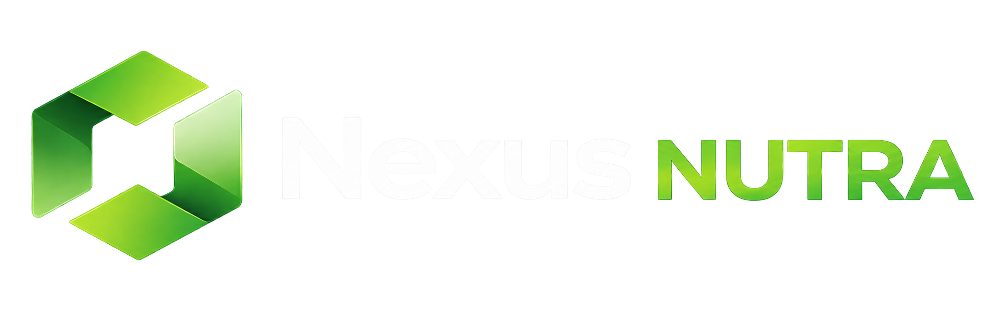
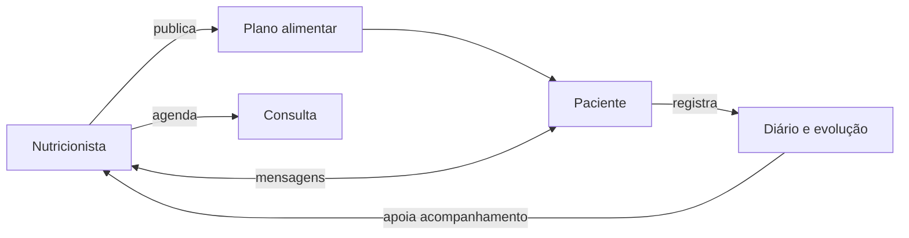

<table align="center">
  <tr>
    <td bgcolor="#101A15"></td>
  </tr>
</table>

<p align="center">
  <strong>Nutrição conectada, cuidado que evolui.</strong><br>
  Plataforma web para gestão nutricional e acompanhamento contínuo entre nutricionistas e pacientes.
</p>

<p align="center">
  
  
  
  
  
</p>

## Sobre o projeto

O **Nexus Nutra** é uma aplicação da linha Nexus criada para aproximar o atendimento profissional da rotina real do paciente. O nutricionista organiza pacientes, publica planos alimentares, acompanha registros e agenda consultas. O paciente acessa o plano, registra refeições e peso, consulta compromissos e conversa diretamente com o profissional.

Esta versão substitui o antigo protótipo LifeTrack e estabelece uma base segura, testável e responsiva para a evolução do produto.

> **Importante:** o sistema é uma ferramenta de apoio. Cálculos, planos e condutas devem ser revisados por nutricionista legalmente habilitado. Antes de uso assistencial em produção, valide requisitos jurídicos, LGPD, retenção e certificações aplicáveis ao seu contexto.

## Novidades da v1.5.2 — Nexus Line

- 38 ícones redesenhados na linguagem visual comum do ecossistema Nexus;
- grade de 24 px, traço de 1,75 px e terminações arredondadas em toda a interface;
- vocabulário específico para nutrição, clínica e jornada do paciente;
- manifesto versionado, categorias semânticas e validação automatizada do sprite;
- documentação de acessibilidade, identidade e regras para evolução da biblioteca.

## Base SaaS e segurança de produção — v1.5.1

- tabela comercial proposta com planos Essencial, Profissional e Clínica em reais;
- alternância acessível entre cobrança mensal e anual;
- decisão arquitetural registrada: Hostinger VPS e PostgreSQL como banco principal de produção;
- SQLite restrito ao desenvolvimento e aos testes; MySQL/MariaDB permanece como alternativa futura;
- política CSP, HSTS em produção, proteção contra framing e isolamento de origem;
- cookies `Secure`, `HttpOnly` e `SameSite=Lax`, sessão absoluta de oito horas e nome `__Host-` em produção;
- validação de domínio e proxy confiável, limites de formulário e respostas autenticadas sem cache;
- senha mínima de 12 caracteres e checklist formal antes da entrada de dados reais.

## Funcionalidades

### Para nutricionistas

- painel com pacientes, consultas, mensagens pendentes e planos ativos;
- cadastro e vínculo de pacientes ao consultório;
- prontuário clínico com anamnese versionada, antropometria e linha do tempo;
- comparação entre avaliações, consentimentos e anexos com acesso restrito;
- relatório clínico profissional para impressão ou PDF;
- criação rápida de planos por refeições, com versões e histórico de revisões;
- catálogo brasileiro pesquisável, alimentos personalizados e receitas calculadas;
- cálculo automático de calorias, proteínas, carboidratos, gorduras, fibras, cálcio, ferro, sódio, gordura saturada e açúcares;
- alertas clínicos de alergênicos e restrições antes da publicação;
- definição de metas e visualização de adequação nutricional;
- reutilização de planos como modelo e sugestões de alternativas;
- impressão profissional do plano em PDF pelo navegador;
- publicação do plano diretamente na conta do paciente;
- agenda para consultas presenciais e online, com disponibilidade, bloqueios e controle de conflitos;
- painel “Hoje”, estados da consulta, histórico, lembretes internos e exportação ICS;
- chat contextualizado com cada paciente.
- criação de metas de hábitos e comentários profissionais no diário do paciente;

### Para pacientes

- painel pessoal com plano atual e próximos compromissos;
- visualização clara do plano por refeições e alimentos;
- diário com foto, adesão, fome, humor, saciedade, hidratação, sintomas e orientações;
- jornada de hábitos e check-in semanal de bem-estar;
- histórico de peso com gráfico de evolução;
- agenda com confirmação, cancelamento, reagendamento e acesso seguro à consulta online;
- canal direto de mensagens com o nutricionista.

### Experiência e engenharia

- interface própria, responsiva e acessível em português do Brasil;
- PWA instalável, navegação móvel dedicada e fallback offline sem dados sensíveis;
- biblioteca autoral de ícones SVG, leve, consistente e sem dependências externas;
- senhas protegidas com o mecanismo seguro do Werkzeug;
- proteção CSRF em todas as operações de escrita;
- cookies de sessão `Secure`, `HttpOnly`, `SameSite=Lax` e prefixo `__Host-` em produção;
- expiração de sessão, revogação de outros dispositivos e bloqueio progressivo de login;
- trilha de auditoria para ações sensíveis da agenda, identidade e prontuário;
- consentimento de privacidade versionado;
- confirmação de e-mail e recuperação de senha com tokens de uso único;
- entrega transacional configurável por SMTP com TLS ou SSL;
- CSP, HSTS, proteção contra framing e cabeçalhos de isolamento de origem;
- consultas parametrizadas e chaves estrangeiras ativas;
- testes automatizados e CI com GitHub Actions;
- banco SQLite inicializado automaticamente apenas no ambiente local/testes;
- PostgreSQL definido como banco principal da futura operação na Hostinger VPS.

## Tecnologias

| Camada | Tecnologia |
|---|---|
| Back-end | Python 3.10+ e Flask 3.1 |
| Interface | Jinja2, HTML5, CSS3 e JavaScript puro |
| Banco | SQLite 3 local/testes; PostgreSQL planejado para produção |
| Segurança | Werkzeug, sessão Flask, CSRF, autorização por vínculo e tokens SHA-256 |
| Comunicação | SMTP transacional com TLS/SSL |
| Qualidade | Pytest, Ruff e GitHub Actions |

## Como executar localmente

### 1. Preparar o ambiente

```bash
git clone https://github.com/ricardogomesbarreto/Nexus-Nutra.git
cd Nexus-Nutra
python -m venv .venv
```

Ative o ambiente virtual:

```bash
# Linux/macOS
source .venv/bin/activate

# Windows PowerShell
.venv\Scripts\Activate.ps1
```

### 2. Instalar e configurar

```bash
pip install -r requirements.txt
cp .env.example .env
```

Defina `SECRET_KEY` no seu ambiente antes de publicar. Para gerar uma chave:

```bash
python -c "import secrets; print(secrets.token_hex(32))"
```

Para os fluxos de identidade, configure também `PUBLIC_BASE_URL`, `SMTP_HOST`,
`SMTP_PORT`, `SMTP_USERNAME`, `SMTP_PASSWORD` e `MAIL_FROM`. Em produção,
use `APP_ENV=production`, `MAIL_SUPPRESS_SEND=0`, `TRUSTED_PROXY_HOPS=1`,
`TRUSTED_HOSTS` com o domínio real e mantenha `REQUIRE_EMAIL_VERIFICATION=1`.

Defina `CLINICAL_UPLOAD_FOLDER` e `DIARY_UPLOAD_FOLDER` em diretórios privados,
graváveis pela aplicação e fora de qualquer servidor público de arquivos.

> **Bloqueio de lançamento:** a v1.5.1 ainda usa SQLite no runtime. Não receba dados
> clínicos reais em produção antes de concluir e testar a migração para PostgreSQL.
> Consulte [Arquitetura de produção](docs/PRODUCTION_ARCHITECTURE.md) e
> [Segurança](SECURITY.md).

### 3. Iniciar

```bash
flask --app app run --debug
```

Acesse `http://127.0.0.1:5000`. O banco é criado automaticamente em `instance/nexus_nutra.db`.

## Testes e qualidade

```bash
pytest
ruff check .
```

O workflow `Nexus Nutra CI` executa essas validações em cada push e pull request para a branch `main`.

## Estrutura

```text
Nexus-Nutra/
├── .github/workflows/ci.yml
├── nexus_nutra/
│   ├── __init__.py
│   ├── auth.py
│   ├── clinical.py
│   ├── db.py
│   ├── mailer.py
│   ├── nutrition.py
│   └── routes.py
├── static/
│   ├── css/app.css
│   ├── img/
│   │   ├── nexus-app-icon.svg
│   │   ├── nexus-icons.svg
│   │   ├── nexus-icons-manifest.json
│   │   └── nexus-nutra-logo-transparent.png
│   ├── js/
│   │   ├── app.js
│   │   └── service-worker.js
│   └── manifest.webmanifest
├── templates/
│   ├── _icons.html
│   ├── journey.html
│   ├── offline.html
│   └── nutrition_workspace.html
├── tests/
├── docs/
│   ├── BACKUP_RESTORE.md
│   ├── ICONOGRAFIA.md
│   └── PRODUCTION_ARCHITECTURE.md
├── CHANGELOG.md
├── ROADMAP.md
├── app.py
├── schema.sql
└── requirements.txt
```

## Arquitetura funcional



## Roadmap

| Versão | Nome | Foco principal |
|---|---|---|
| v1.1.0 | Catálogo Inteligente ✅ | alimentos TACO, metas, alternativas e impressão |
| v1.2.0 | Agenda Segura ✅ | disponibilidade, conflitos, estados, ICS, auditoria e sessões |
| v1.2.1 | Identidade Segura ✅ | recuperação de senha, verificação de e-mail e SMTP |
| v1.3.0 | Prontuário Clínico ✅ | anamnese, antropometria, evolução, anexos e consentimentos |
| v1.4.0 | Inteligência Nutricional ✅ | receitas, alimentos personalizados, alertas, nutrientes e planos versionados |
| v1.5.0 | Jornada do Paciente ✅ | PWA, fotos privadas, hábitos, check-ins e comentários |
| v1.5.1 | Base SaaS Segura ✅ | Hostinger, arquitetura PostgreSQL, preços BRL e hardening |
| v1.5.2 | Nexus Line ✅ | iconografia autoral padronizada para o ecossistema Nexus |
| v1.6.0 | Persistência de Produção | PostgreSQL, migrações, backup, restore e observabilidade |
| v1.7.0 | Gestão de Clínicas | equipes, unidades, permissões, financeiro e indicadores |
| v1.8.0 | Integrações | API, calendários, videoconferência, webhooks e wearables |
| v1.9.0 | Escala Operacional | filas, armazenamento, observabilidade e testes de carga |
| v2.0.0 | Nexus Nutra Platform | SaaS multiempresa, assinaturas e personalização |

Consulte o [roadmap completo](ROADMAP.md) para prioridades, dependências, critérios de entrega e melhorias transversais.

## Segurança e privacidade

Dados de saúde exigem cuidado especial. Antes do uso em produção, implemente HTTPS, política de retenção, consentimento, controle granular de acesso, logs de auditoria, backup criptografado, recuperação de desastre e avaliação jurídica/técnica de conformidade com a LGPD.

Vulnerabilidades não devem ser publicadas em issues abertas. Comunique o mantenedor por um canal privado.

## Fontes nutricionais

O catálogo inicial utiliza uma seleção de valores por 100 g da **Tabela Brasileira de Composição de Alimentos — TACO, 4ª edição**, publicada pelo NEPA/UNICAMP. Medidas caseiras são referências de interface e não substituem a avaliação profissional.

- [NEPA/UNICAMP — Tabela TACO 4ª edição](https://nepa.unicamp.br/)

## Identidade

**Nexus Nutra** faz parte da linha de aplicações Nexus e utiliza uma identidade verde, clara e acolhedora para representar conexão, equilíbrio e evolução. A marca incluída neste repositório pertence ao projeto. A interface adota a família autoral **Nexus Line**, com vocabulário próprio de nutrição e regras descritas no [guia de iconografia](docs/ICONOGRAFIA.md).

## Autor

Desenvolvido por **Ricardo Gomes Barreto**.
