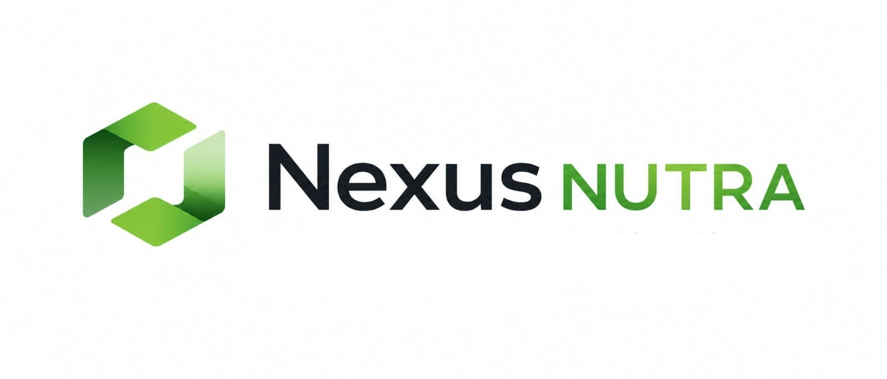
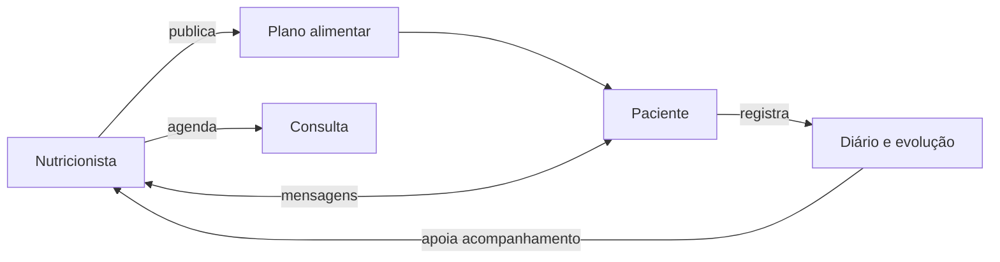

<p align="center">
  
</p>

<p align="center">
  <strong>Nutrição conectada, cuidado que evolui.</strong><br>
  Plataforma web para gestão nutricional e acompanhamento contínuo entre nutricionistas e pacientes.
</p>

<p align="center">
  
  
  
  
  
</p>

## Sobre o projeto

O **Nexus Nutra** é uma aplicação da linha Nexus criada para aproximar o atendimento profissional da rotina real do paciente. O nutricionista organiza pacientes, publica planos alimentares, acompanha registros e agenda consultas. O paciente acessa o plano, registra refeições e peso, consulta compromissos e conversa diretamente com o profissional.

Esta versão substitui o antigo protótipo LifeTrack e estabelece uma base segura, testável e responsiva para a evolução do produto.

> **Importante:** o sistema é uma ferramenta de apoio. Cálculos, planos e condutas devem ser revisados por nutricionista legalmente habilitado. A versão atual não substitui prontuário clínico certificado nem aconselhamento profissional.

## Novidades da v1.1.0 — Catálogo Inteligente

- catálogo inicial de alimentos brasileiros baseado na TACO 4ª edição;
- busca por nome e filtragem por categoria alimentar;
- cálculo automático no navegador e recálculo seguro no servidor por quantidade;
- metas de energia, macro e micronutrientes por plano;
- indicadores de adequação entre totais calculados e metas definidas;
- alternativas da mesma categoria para apoiar substituições;
- reutilização de planos anteriores como modelo, sem alterar o original;
- documento profissional otimizado para impressão ou salvamento em PDF;
- migração automática que preserva bancos criados na v1.0.0.

## Funcionalidades

### Para nutricionistas

- painel com pacientes, consultas, mensagens pendentes e planos ativos;
- cadastro e vínculo de pacientes ao consultório;
- prontuário resumido com objetivo, peso, planos e diário recente;
- criação rápida de planos por refeições;
- catálogo brasileiro pesquisável durante a prescrição;
- cálculo automático de calorias, proteínas, carboidratos, gorduras, fibras, cálcio e ferro;
- definição de metas e visualização de adequação nutricional;
- reutilização de planos como modelo e sugestões de alternativas;
- impressão profissional do plano em PDF pelo navegador;
- publicação do plano diretamente na conta do paciente;
- agenda para consultas presenciais e online;
- chat contextualizado com cada paciente.

### Para pacientes

- painel pessoal com plano atual e próximos compromissos;
- visualização clara do plano por refeições e alimentos;
- diário alimentar com adesão e nível de fome;
- histórico de peso com gráfico de evolução;
- agenda com acesso ao link de consulta online;
- canal direto de mensagens com o nutricionista.

### Experiência e engenharia

- interface própria, responsiva e acessível em português do Brasil;
- senhas protegidas com o mecanismo seguro do Werkzeug;
- proteção CSRF em todas as operações de escrita;
- cookies de sessão `HttpOnly` e `SameSite=Lax`;
- cabeçalhos básicos de segurança;
- consultas parametrizadas e chaves estrangeiras ativas;
- testes automatizados e CI com GitHub Actions;
- banco SQLite inicializado automaticamente no primeiro uso.

## Tecnologias

| Camada | Tecnologia |
|---|---|
| Back-end | Python 3.10+ e Flask 3.1 |
| Interface | Jinja2, HTML5, CSS3 e JavaScript puro |
| Banco | SQLite 3 |
| Segurança | Werkzeug, sessão Flask e token CSRF |
| Qualidade | Pytest, Ruff e GitHub Actions |

## Como executar localmente

### 1. Preparar o ambiente

```bash
git clone https://github.com/ricardogomesbarreto/Nexus-Nutra.git
cd Nexus-Nutra
python -m venv .venv
```

Ative o ambiente virtual:

```bash
# Linux/macOS
source .venv/bin/activate

# Windows PowerShell
.venv\Scripts\Activate.ps1
```

### 2. Instalar e configurar

```bash
pip install -r requirements.txt
cp .env.example .env
```

Defina `SECRET_KEY` no seu ambiente antes de publicar. Para gerar uma chave:

```bash
python -c "import secrets; print(secrets.token_hex(32))"
```

### 3. Iniciar

```bash
flask --app app run --debug
```

Acesse `http://127.0.0.1:5000`. O banco é criado automaticamente em `instance/nexus_nutra.db`.

## Testes e qualidade

```bash
pytest
ruff check .
```

O workflow `Nexus Nutra CI` executa essas validações em cada push e pull request para a branch `main`.

## Estrutura

```text
Nexus-Nutra/
├── .github/workflows/ci.yml
├── nexus_nutra/
│   ├── __init__.py
│   ├── db.py
│   └── routes.py
├── static/
│   ├── css/app.css
│   ├── img/nexus-nutra-logo.jpeg
│   └── js/app.js
├── templates/
├── tests/
├── CHANGELOG.md
├── app.py
├── schema.sql
└── requirements.txt
```

## Arquitetura funcional



## Roadmap

### v1.1.0 — Catálogo Inteligente ✅

- catálogo TACO inicial com busca, categorias e medidas caseiras;
- cálculo por quantidade, metas e indicadores de adequação;
- alternativas alimentares, reaproveitamento de planos e impressão/PDF.

### v1.2 — Agenda e automações

- disponibilidade do profissional e solicitação de horários;
- lembretes por e-mail e notificações;
- confirmação, cancelamento e reagendamento;
- integração com provedores de videoconferência.

### v1.3 — Avaliação nutricional

- anamnese configurável;
- antropometria e composição corporal;
- metas clínicas e relatórios comparativos;
- anexos e registro de consentimentos.

### v1.4 — Operação de clínicas

- múltiplos profissionais e unidades;
- permissões por função;
- indicadores operacionais e financeiros;
- trilha de auditoria e adequações avançadas à LGPD.

### v2.0 — Plataforma Nexus Nutra

- API versionada e aplicativo instalável (PWA);
- base PostgreSQL e tarefas assíncronas;
- integrações com pagamentos, calendários e wearables;
- infraestrutura de produção, observabilidade e backups.

## Segurança e privacidade

Dados de saúde exigem cuidado especial. Antes do uso em produção, implemente HTTPS, política de retenção, consentimento, controle granular de acesso, logs de auditoria, backup criptografado, recuperação de desastre e avaliação jurídica/técnica de conformidade com a LGPD.

Vulnerabilidades não devem ser publicadas em issues abertas. Comunique o mantenedor por um canal privado.

## Fontes nutricionais

O catálogo inicial utiliza uma seleção de valores por 100 g da **Tabela Brasileira de Composição de Alimentos — TACO, 4ª edição**, publicada pelo NEPA/UNICAMP. Medidas caseiras são referências de interface e não substituem a avaliação profissional.

- [NEPA/UNICAMP — Tabela TACO 4ª edição](https://nepa.unicamp.br/)

## Identidade

**Nexus Nutra** faz parte da linha de aplicações Nexus e utiliza uma identidade verde, clara e acolhedora para representar conexão, equilíbrio e evolução. A marca incluída neste repositório pertence ao projeto.

## Autor

Desenvolvido por **Ricardo Gomes Barreto**.
