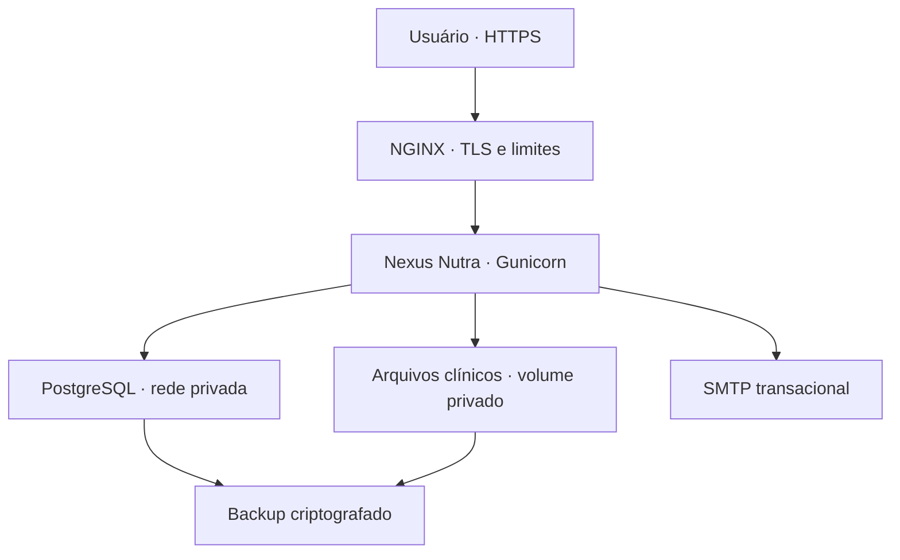

# Arquitetura de produção — Nexus Nutra

**Decisão registrada em:** 23 de setembro de 2026  
**Hospedagem:** Hostinger VPS  
**Banco principal:** PostgreSQL  
**Alternativa futura:** MySQL/MariaDB  
**Banco local/testes:** SQLite

## Decisão

O Nexus Nutra será publicado em uma **Hostinger VPS**, atrás de NGINX com TLS, e
usará **PostgreSQL** como banco transacional principal. PostgreSQL foi escolhido
para evitar dois dialetos de produção simultâneos, simplificar testes e oferecer
uma base robusta para isolamento de organizações, auditoria, assinaturas e dados
clínicos. MySQL/MariaDB poderá ser adicionado depois por uma camada de repositórios,
mas não é um alvo da primeira entrada em produção.

SQLite permanece útil para desenvolvimento rápido e testes unitários. Ele não é
aprovado para armazenar dados reais de pacientes em produção.

## Topologia alvo

Somente as portas 80/443 ficam públicas. SSH deve usar chave, usuário sem root e
restrição por firewall. PostgreSQL não deve expor a porta 5432 para a internet.

## Fases obrigatórias

### v1.5.1 — fundação concluída

- decisão de infraestrutura e banco registrada;
- landing comercial em BRL;
- configuração segura de proxy, host, cookies e cabeçalhos;
- política de resposta e checklist de segurança;
- bloqueio explícito para uso clínico real enquanto o runtime usar SQLite.

### v1.6.0 — persistência de produção

- SQLAlchemy 2 e Alembic como camada de persistência e migrations;
- modelos independentes de SQLite;
- PostgreSQL em desenvolvimento, CI e homologação;
- migração validada de todos os dados e anexos;
- usuário de banco com menor privilégio e conexão TLS;
- testes de concorrência, autorização por organização e rollback;
- backup diário criptografado e restauração comprovada;
- health checks, logs estruturados, métricas e alertas.

### Após estabilização

- avaliar MySQL/MariaDB somente se houver necessidade comercial concreta;
- filas para e-mail, lembretes e tarefas demoradas;
- alta disponibilidade e réplica conforme volume e metas de recuperação.

## Dados e segredos

- nunca versionar `.env`, chaves, senhas ou dumps;
- usar uma credencial exclusiva da aplicação, sem permissão de superusuário;
- separar banco de produção, homologação e testes;
- armazenar anexos fora da raiz pública e servi-los sempre após autorização;
- criptografar backups e testar restauração em ambiente isolado;
- rotacionar chaves e credenciais em incidentes e em calendário definido;
- manter conteúdo clínico fora de analytics, logs e mensagens de erro.

## Metas de continuidade

| Controle | Meta inicial |
|---|---|
| Backup do banco | diário, criptografado e com retenção definida |
| Backup de anexos | diário e consistente com o banco |
| Teste de restauração | mensal |
| RPO | até 24 horas na fase inicial |
| RTO | até 8 horas na fase inicial |
| Atualizações críticas | janela emergencial documentada |

## Checklist antes de dados reais

- [ ] PostgreSQL ativo e coberto por testes de integração no CI;
- [ ] migration SQLite → PostgreSQL ensaiada com cópia anonimizada;
- [ ] domínio, TLS, `TRUSTED_HOSTS` e proxy validados;
- [ ] SMTP real, verificação de e-mail e recuperação testados;
- [ ] backup e restauração de banco e anexos comprovados;
- [ ] política de retenção, descarte e solicitações do titular aprovada;
- [ ] revisão de autorização entre nutricionista, paciente e organização;
- [ ] plano de resposta a incidentes e contato de segurança definidos;
- [ ] avaliação jurídica e de LGPD concluída;
- [ ] monitoramento e alertas operacionais ativos.

